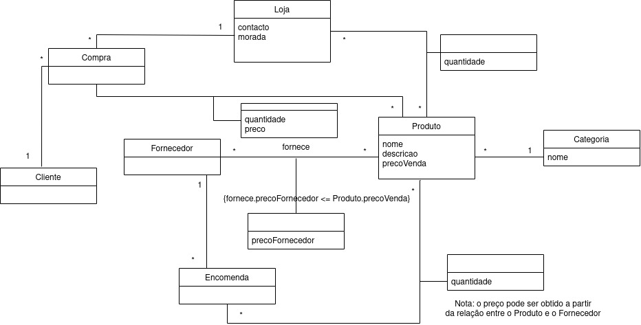

# Question 12

Check if the left side of every fd is a super key.

# Question 13



# Question 14

```sql
SELECT Estudante.nome as Estudante, Curso.nome as Curso
FROM Estudante JOIN Curso on (Curso.ID = Estudante.curso)
WHERE anoCurricular = 3;
```

# Question 15

```sql
SELECT nome
FROM Estudante
WHERE Estudante.ID in 
    (SELECT ID1 as ID 
     FROM Amizade
     GROUP BY ID1
     HAVING count(ID1) > 3);
```

# Question 16

```sql
SELECT nome as Nome, anoCurricular as 'Ano Curricular'
FROM Estudante
WHERE ID not in 
    (SELECT DISTINCT ID1 as ID
     FROM (Amizade JOIN Estudante as E2 on Amizade.ID2 = E2.ID) JOIN Estudante as E1 on Amizade.ID1 = E1.ID
     WHERE E1.anoCurricular <> E2.anoCurricular) 
AND ID in (SELECT ID1 as ID from Amizade);
```

# Question 17

```sql
SELECT DISTINCT A3.ID2 as ID
FROM ((SELECT * FROM Amizade WHERE ID1 = 201101025) as A1 JOIN Amizade as A2 ON A1.ID2 = A2.ID1) JOIN Amizade as A3 ON A2.ID2 = A3.ID1; -- More efficient than using WHERE ID1 = 201101025
```

# Question 18

```sql
SELECT nome, anoCurricular
FROM 
    (SELECT nome, anoCurricular, max(cnt)
    FROM
        (SELECT ID1, count(ID2) as cnt
         FROM Amizade
         GROUP BY ID1) JOIN Estudante on ID1 = ID);
        
```

# Question 19

```sql
DROP TRIGGER IF EXISTS StudentInsert;

CREATE TRIGGER StudentInsert
AFTER INSERT ON Estudante
FOR EACH ROW
BEGIN
    INSERT INTO Amizade 
        select New.ID, ID from Estudante where ID <> New.ID and New.curso = curso;
    INSERT INTO Amizade 
        select ID, New.ID from Estudante where ID <> New.ID and New.curso = curso;
END;
```
